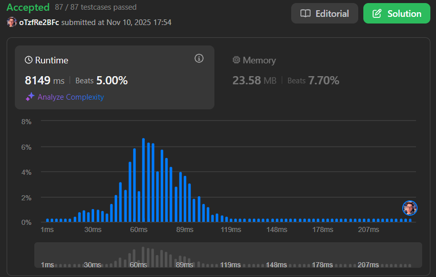

# Dividir e Conquistar - LeetCode

**Conteúdo da Disciplina**: Dividir e Conquistar (Divide and Conquer)

## Aluno
| Matrícula    | Aluno                           |
| ------------ | ------------------------------ |
| 21/1041221   | LUAN MATEUS CESAR DUARTE       |

## Sobre

Este diretório reúne soluções para problemas de algoritmos de Dividir e Conquistar disponíveis na plataforma LeetCode. O objetivo é aplicar a técnica de dividir o problema em subproblemas menores, resolver recursivamente e combinar as soluções, evidenciando o entendimento dos conceitos e técnicas estudados.

## Resumo dos Exercícios

### Exercício 4: Median of Two Sorted Arrays
Neste exercício, o objetivo é encontrar a mediana de dois arrays ordenados. A solução utiliza busca binária para dividir os arrays em partições, garantindo complexidade O(log(min(m,n))). O algoritmo divide o problema encontrando o ponto de corte correto que separa os elementos menores dos maiores.

Arquivo: `4.py`

Link para submissão: [LeetCode - 4](https://leetcode.com/problems/median-of-two-sorted-arrays/submissions/1826361758)

---

### Exercício 327: Count of Range Sum
Neste exercício, o objetivo é contar quantos intervalos de soma estão dentro de um limite especificado. A solução utiliza o paradigma de dividir e conquistar com merge sort modificado. Durante a fase de conquista, conta-se os pares válidos entre as metades divididas, e na fase de combinação, os elementos são ordenados para facilitar contagens futuras.

Arquivo: `327.py`

Link para submissão: [LeetCode - 327](https://leetcode.com/problems/count-of-range-sum/submissions/1826334115)

---

### Exercício 973: K Closest Points to Origin
Neste exercício, o objetivo é encontrar os K pontos mais próximos da origem. A solução utiliza o algoritmo Quickselect, uma variação do Quicksort que aplica dividir e conquistar. O algoritmo particiona recursivamente o array até encontrar os K elementos menores, com complexidade média O(n).

Arquivo: `973.py`

Link para submissão: [LeetCode - 973](https://leetcode.com/problems/k-closest-points-to-origin/submissions/1826357352)

---

## Vídeo Explicativo

Link do vídeo: [Vídeo Explicativo]()

## Linguagem Utilizada
Python
